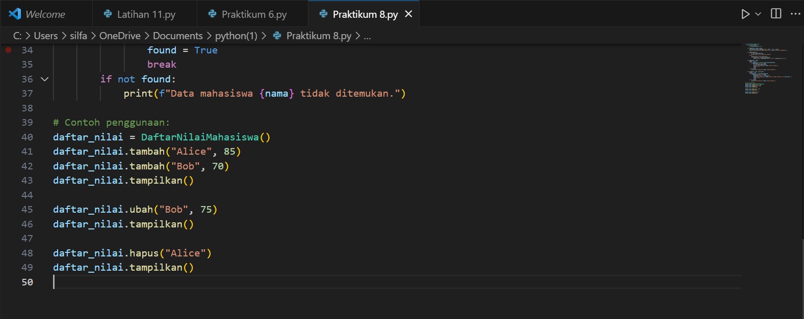

# LANGKAH-LANGKAH
1. Buat kelas DaftarNilaiMahasiswa yang akan menangani daftar nilai mahasiswa.
2. Tambahkan metode tambah() untuk menambahkan data nilai mahasiswa ke dalam daftar.
3. Buat metode tampilkan() untuk menampilkan seluruh data nilai mahasiswa.
4. Lakukan inisialisasi objek dari kelas DaftarNilaiMahasiswa dan panggil metode-metodenya untuk menambah dan menampilkan data nilai mahasiswa.
5. Lalu buatlah daftar nilai mahasiswa dan menampilkan data nilai yang telah ditambahkan ke dalam objek dari kelas DaftarNilaiMahasiswa.

# PRAKTIKUM

# DIAGRAM CLASS

# FLOWCHART

